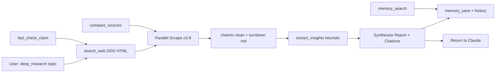

<p align="center">
  
</p>

<h1 align="center">Deep Research MCP Server</h1>
<p align="center"><b>Non-generic MCP for real research. Search → Scrape → Synthesize → Fact-check → Remember.</b></p>

<p align="center">
  [](https://mcpize.com/mcp/deep-research-32)
  <a href="https://github.com/SECRET4422/mcp-deep-research-server/actions"></a>
  <a href="LICENSE"></a>
  <a href="package.json"></a>
  <a href="https://modelcontextprotocol.io"></a>
  <a href="https://www.npmjs.com/package/mcp-deep-research-server"></a>
  
</p>

---

### Why not generic?

| Generic MCP (boring) | This MCP (pro) |
|---|---|
| `echo`, `fetch` | **Orchestrated deep research** |
| Returns raw HTML | **Cheerio + Turndown → clean markdown** + headings, links, meta |
| No memory | **Persistent memory** in `~/.mcp-deep-research/` |
| One page at a time | **Parallel 3-worker scraper**, 10min cache |
| No reasoning | **Fact-check with stance scoring**, contradiction detection |

### Architecture



### Tools (8)

| Tool | What it does | Params |
|------|--------------|--------|
| `search_web` | DuckDuckGo HTML search, no API key, UDDG decode | `query, count 1-10, timeFilter` |
| `scrape_page` | Fetch + main-content heuristic + markdown | `url, format=markdown|text|full, extractMainOnly` |
| `extract_insights` | Entities, stats regex, key-point scoring, reading time | `content, goal?` |
| `deep_research` | **Power tool** — search → parallel scrape → synthesize report | `topic, depth=quick|standard|deep, maxSources, saveMemory` |
| `compare_sources` | 2-5 URLs → consensus vs unique vs contradictions | `urls[], focus?` |
| `fact_check_claim` | Searches support + `debunked OR false`, heuristic verdict | `claim, searchDepth` |
| `memory_save` | Save finding to JSON, survives restarts | `key, value, tags[], source?` |
| `memory_search` | Fuzzy search in persistent memory | `query, tags[], limit` |

**Resources:**
- `research://memory` — all saved findings
- `research://history` — last 100 actions
- `research://stats` — cache size, uptime

**Prompts:**
- `deep-dive-research` — full research workflow
- `fact-check` — fact-checker squad
- `compare-narratives` — bias & comparison table

### Install

```bash
git clone https://github.com/SECRET4422/mcp-deep-research-server.git
cd mcp-deep-research-server
npm install
npm run build
```

### Connect via MCPize

Use this MCP server instantly with no local installation:

```bash
npx -y mcpize connect @SECRET4422/deep-research-32 --client claude
```

Or connect at: **https://mcpize.com/mcp/deep-research-32**

### Test (smoke)

```bash
npm run test:mcp
# or
npm run inspect # opens http://localhost:6274
```

Manually tested:
```
[search] Dehradun → 3 results ✓
[deep_research] What is MCP → 3 sources in 2.1s ✓
tools/list → 8 tools ✓
```

### Add to Claude Desktop

Edit config:

- macOS: `~/Library/Application Support/Claude/claude_desktop_config.json`
- Windows: `%APPDATA%\Claude\claude_desktop_config.json`
- Linux: `~/.config/Claude/claude_desktop_config.json`

```json
{
  "mcpServers": {
    "deep-research": {
      "command": "node",
      "args": ["/absolute/path/to/mcp-deep-research-server/build/index.js"]
    }
  }
}
```

Restart Claude Desktop.

### Add to Cursor / Windsurf / VS Code

`.cursor/mcp.json` or `mcp.json`:

```json
{
  "mcpServers": {
    "deep-research": {
      "command": "node",
      "args": ["./build/index.js"],
      "cwd": "/path/to/mcp-deep-research-server"
    }
  }
}
```

### Example Prompts

**Deep Research:**
> Use deep_research to research "Best LLM fine-tuning in 2026, depth deep" then compare LoRA vs QLoRA

**Fact Check:**
> Fact check claim: "Bun is faster than Node" using fact_check_claim

**Compare:**
> Compare these 3 URLs about MCP architecture focusing on security:
> https://modelcontextprotocol.io/docs/getting-started/intro
> https://www.anthropic.com/news/model-context-protocol
> https://en.wikipedia.org/wiki/Model_Context_Protocol

See `examples/claude-example.md` for more.

### Data Storage

All in `~/.mcp-deep-research/`:
- `memory.json` — persistent findings
- `history.json` — audit log (100 max)
- `cache/` — reserved

No DB, no external calls except search/scrape.

### Pro Features in v1.1.0

- ✅ Logo + pro README + badges
- ✅ GitHub Actions CI (Node 18/20/22) + Release workflow
- ✅ Issue templates, PR template, CONTRIBUTING, SECURITY
- ✅ `.editorconfig`, smoke test script
- ✅ Optimized `package.json` for npm publishing
- ✅ CHANGELOG tracked

### Roadmap

- [ ] Tavily / Brave API fallback if keys present
- [ ] PDF parsing via `pdf-parse`
- [ ] YouTube transcript tool
- [ ] Vector search on memory (embeddings)
- [ ] Blocklist for SSRF (169.254.169.254 etc)
- [ ] Smithery registry

### Dev

```bash
npm run dev     # tsx watch
npm run build
npm run lint
```

Guidelines in `CONTRIBUTING.md`.

### License

MIT © SECRET4422 — See LICENSE

> Built with 🧠 for Dehradun → World. Not a generic MCP.