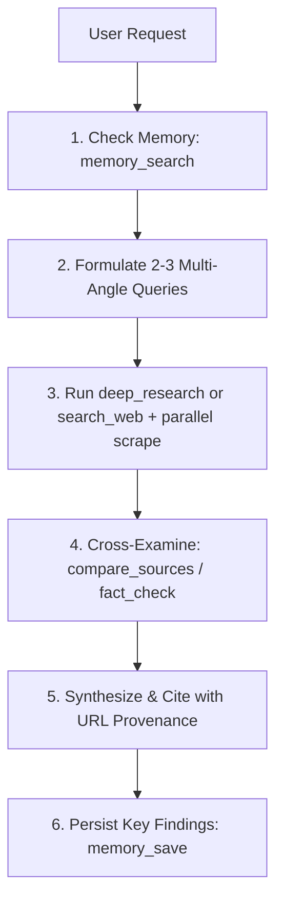

# Deep Research Agent Skill

This skill guides AI agents on orchestrating multi-step, evidence-backed research using the tools exposed by `mcp-deep-research-server`.

## When to Use

- When the user asks for in-depth, cited research on a technology, company, scientific topic, or market trend.
- When an objective fact-check is requested to verify controversial claims or rumors.
- When comparing 2–5 distinct URLs or source narratives to identify consensus vs contradictions.
- When saving or retrieving structured research memory across long-running tasks.

---

## Tool Reference & Routing

| Operation | Primary Tool | Description |
|---|---|---|
| **Full Investigation** | `deep_research` | Automated pipeline: searches DuckDuckGo, parallel-scrapes 3–8 pages, extracts stats/entities, synthesizes cited report. |
| **Targeted Query** | `search_web` | Clean search (1–10 results) with time filtering (`day`, `week`, `month`, `year`). |
| **Page Deep-Dive** | `scrape_page` | Cleans HTML into Turndown markdown, extracts main content, headings, and links. SSRF-safe. |
| **Cross-Source Analysis** | `compare_sources` | Scrapes 2–5 URLs in parallel, surfaces common entities, shared consensus, and contradictory claims. |
| **Verification & Audit** | `fact_check_claim` | Searches supporting and debunking sources, returning an evidence-backed heuristic verdict. |
| **Extract Key Points** | `extract_insights` | Heuristic scoring of statistics, named entities, key sentences, and answered questions. |
| **Long-Term Memory** | `memory_save` / `memory_search` | Persistent storage in `~/.mcp-deep-research/memory.json` for cross-session recall. |

---

## Autonomous Research Workflow

Follow this 5-stage discipline for every deep investigation:



### Stage 1: Check Prior Knowledge
Before firing new web queries, check if relevant research exists in persistent memory:
```json
// Example call:
memory_search({ "query": "Fine-tuning LLMs", "limit": 3 })
```

### Stage 2: Query Formulation
Formulate search queries with precise intent:
- For technical comparisons: `"<Tech A> vs <Tech B> benchmarks latency architecture 2026"`
- For market analysis: `"<Industry> market size CAGR top players report"`
- For troubleshooting: `"<Exact Error String> <Framework> root cause fix"`

### Stage 3: Orchestrated Deep Scraping
Invoke `deep_research` with appropriate depth:
- `depth: "quick"` (3 sources) → Fast sanity checks.
- `depth: "standard"` (5 sources) → Standard reports and architectural evaluations.
- `depth: "deep"` (8 sources) → Comprehensive market maps and critical fact-checking.

```json
// Example call:
deep_research({
  "topic": "State of Model Context Protocol ecosystem and adoption in 2026",
  "depth": "deep",
  "saveMemory": true
})
```

### Stage 4: Fact-Checking & Contradiction Resolution
If two sources provide opposing data (e.g. performance metrics or release dates):
1. Run `compare_sources` with the URLs to view the entity alignment matrix.
2. Run `fact_check_claim` on the specific disputed assertion.

### Stage 5: Structured Synthesis & Output Format
Deliver research outputs adhering to this consistent, publication-ready format:

```markdown
# [Research Topic Title]

## 📋 Executive Summary
A 2-3 sentence distillation answering the user's core question directly with key conclusions.

## 🔑 Key Findings & Empirical Data
- **Finding 1**: Direct takeaway with [Source Name](URL) link.
- **Finding 2**: Quantitative metric / benchmark comparison.

## 📊 Comparison / Architecture Table (if applicable)
| Dimension | Option A | Option B | Consensus / Verdict |
|---|---|---|---|
| Latency | ... | ... | ... |
| Cost | ... | ... | ... |

## ⚖️ Evidence & Source Provenance
1. [Source 1 Title](URL) — Key contribution / excerpt
2. [Source 2 Title](URL) — Key contribution / excerpt

## ⚠️ Known Gaps & Unverified Claims
- Notes on conflicting dates or unverified benchmarks.
```

---

## Safety & Best Practices

1. **Never make unverified claims**: Always link the primary URL as inline markdown (`[Source](url)`).
2. **Handle SSRF & Private Networks**: The underlying server automatically blocks private IP ranges (`127.x`, `10.x`, `192.168.x`, `169.254.x`). If a URL is rejected, report that the host is on a restricted network.
3. **Respect Rate Limits**: When scraping multiple pages, use `compare_sources` or `deep_research` which run with concurrency throttles rather than firing unbounded individual requests.
